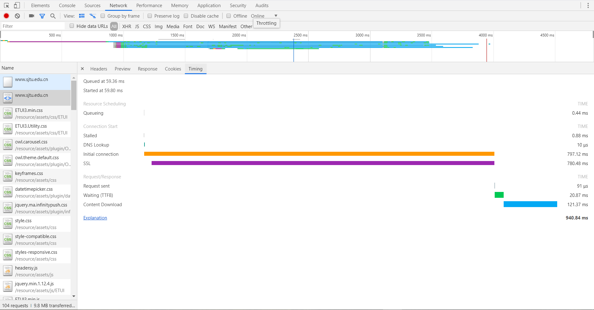
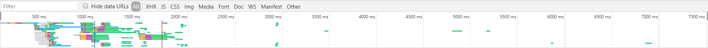
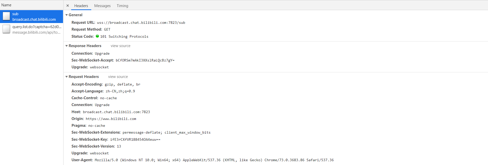
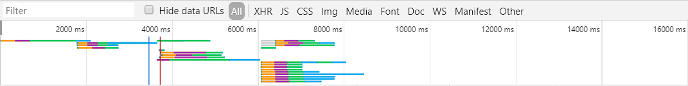

# How to Use F12

原来我用到的F12主要时看网页中的元素，在第一栏Elements里可以看到网页的html代码，并且可以找到对应元素的css样式；而且在写js的时候可以在console中看到输出的内容。

## 网页加载

### Network

用的是Network一项

可以看到加载的各项内容

点击其中的某一项，可以查看详细信息，比如www.sjtu.edu.cn的document

- 请求头部

- 预览请求到的内容
- 请求返回的数据
- cookie
- 响应请求的时间信息

### Waterfall

这部分内容是我这次才了解到的，原来只是看到却没有管它

上图时sjtu官网加载的waterfall，前面的一个是document加载，后面多条主要是加载的css,js与图片，查资料得知浏览器与同一个域名建立的TCP连接数是有限的，最多是6个，如果多于6个就要等待排队，所以加载的图片比较多的情况下排队时间就会增加，这一点可以在waterfall中反映出来

上面请求白色的时间就是在队列中等待的时间

点击某一个请求可以看到具体的waterfall

各个时间段的含义：(reference:<https://developers.google.com/web/tools/chrome-devtools/network-performance/reference#timing-explanation>)

**Stalled/Blocking**
 Time the request spent waiting before it could be sent. This time is
 inclusive of any time spent in proxy negotiation. Additionally, this
 time will include when the browser is waiting for an already
 established connection to become available for re-use, obeying
 Chrome's maximum six TCP connection per origin rule.
 **Proxy Negotiation**
 Time spent negotiating with a proxy server connection.
 **DNS Lookup**
 Time spent performing the DNS lookup. Every new domain on a page
 requires a full roundtrip to do the DNS lookup.
 **Initial Connection / Connecting**
 Time it took to establish a connection, including TCP
 handshakes/retries and negotiating a SSL.
 **SSL**
 Time spent completing a SSL handshake.
 **Request Sent / Sending**
 Time spent issuing the network request. Typically a fraction of a
 millisecond.
 **Waiting (TTFB)**
 Time spent waiting for the initial response, also known as the Time To
 First Byte. This time captures the latency of a round trip to the
 server in addition to the time spent waiting for the server to deliver
 the response.
 **Content Download / Downloading**
 Time spent receiving the response data.

瀑布图是一个直观反映网页加载情况的图，如果目的是让页面加载的更快，瀑布图上的反映是：

1. 减小瀑布图的宽度，瀑布图 越窄，网站的加载时间越短
2. 减低瀑布图的高度，就是减少请求数量
3. 优化资源请求顺序来加快渲染时间，在瀑布图上的反映就是绿色的开始渲染线向左移

## 比较

### 与Bilibili主页比较

https://www.bilibili.com/

B站主页图片较多

观察这次的waterfall，发现与sjtu主页有很大差别

可以看出，同时发出的请求较多，由于浏览器只能与一个TCP站点建立6个连接，这里B站的优化是把图片放在不同主机上

有意思的是B站这里有一个websocket长连接

然后会有一个请求在定时发出（大约每隔5秒发一次），可能是已经在登录的情况下想请求新的消息

### 与Github主页比较

<https://github.com/>

一开始我在想GitHub主页应该没什么图片，打开发现好多没注意到，比如用户的头像等等，GitHub用的方法也与B站类似，将图片分到不同的站点上

而且那些用户头像等信息是在网页渲染后再加载上去的

GitHub加载慢的原因我才可能是服务器位置远，查服务器ip得知服务器位置在新加坡，估计是也用到了CDN（有意思的是在百度上查请求的ip显示服务器在美国，google了几个外国的查ip的网站说是在新加坡）

## 优化

网页请求的数据主要是：html文件，css和js文件，图片图标等

1. 图片分站点请求
2. 可以合并一些css，js文件来减少HTTP请求的数量
3. 使用CDN
4. 精简css，js文件
5. 压缩图片
6. 将小图标合并成sprite图或者iconfont字体文件
7. 用base64减少不必要的网络请求

## References

[Chrome DevTools](https://developers.google.com/web/tools/chrome-devtools/network-performance/resource-loading?hl=zh-cn)

[Resource Timing](https://developers.google.com/web/tools/chrome-devtools/network-performance/understanding-resource-timing?hl=zh-cn)

<https://www.cnblogs.com/shengulong/p/7449927.html>

<https://segmentfault.com/a/1190000010302235?utm_source=tag-newest>

<https://www.jianshu.com/p/24b93b13e5a9>

## Others

记一下一些有意思的东西

* sprite图
* SSL
* 网站证书

