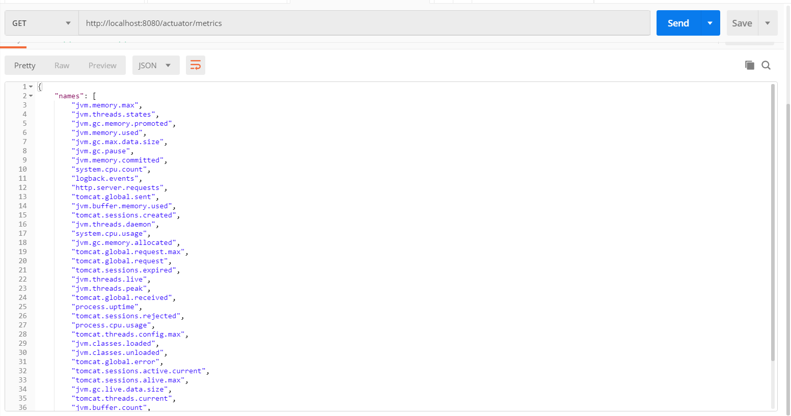
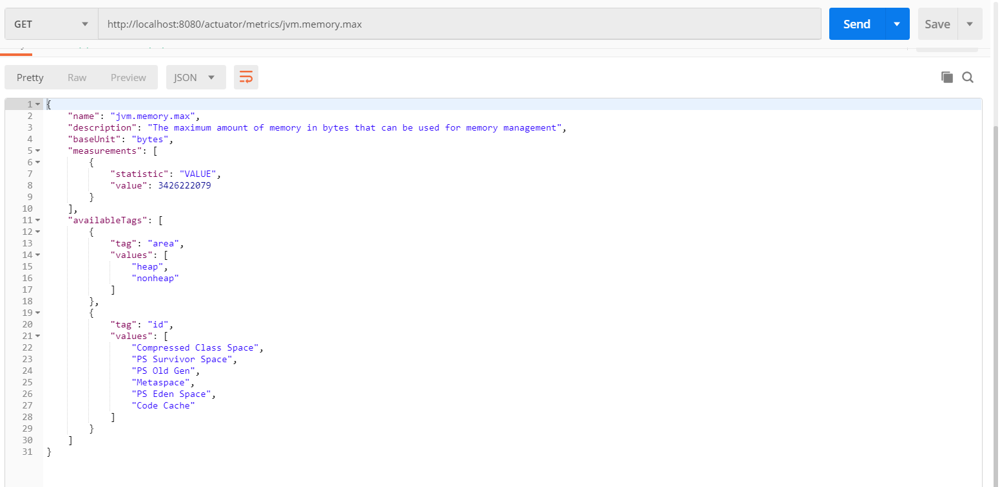
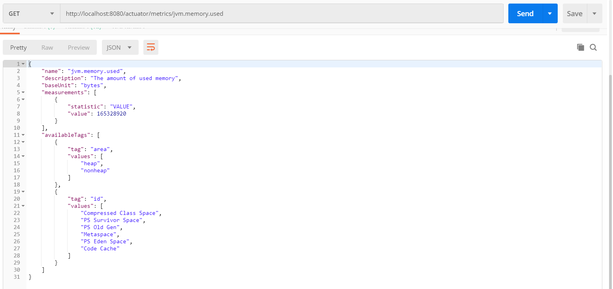
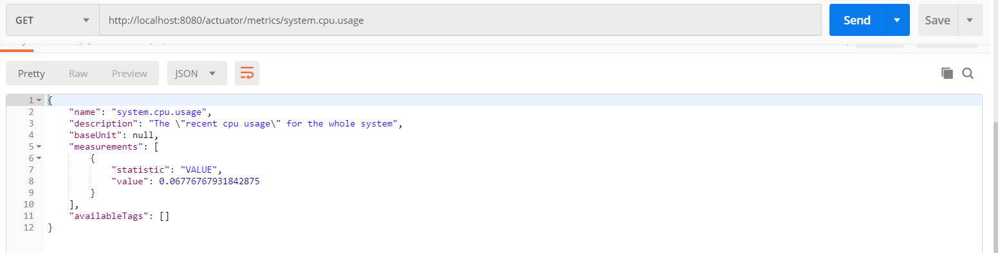
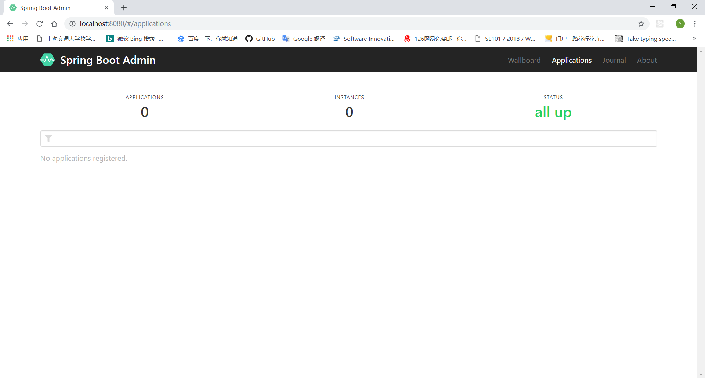
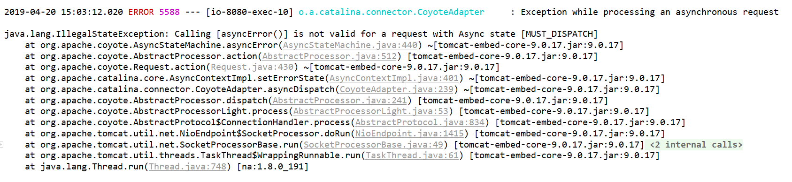
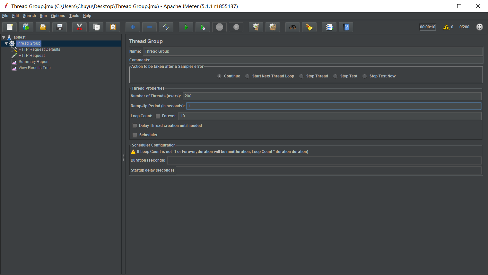
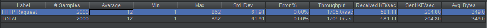
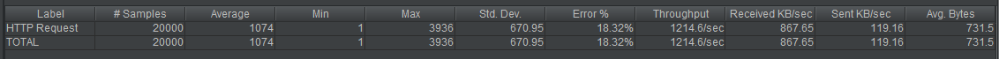
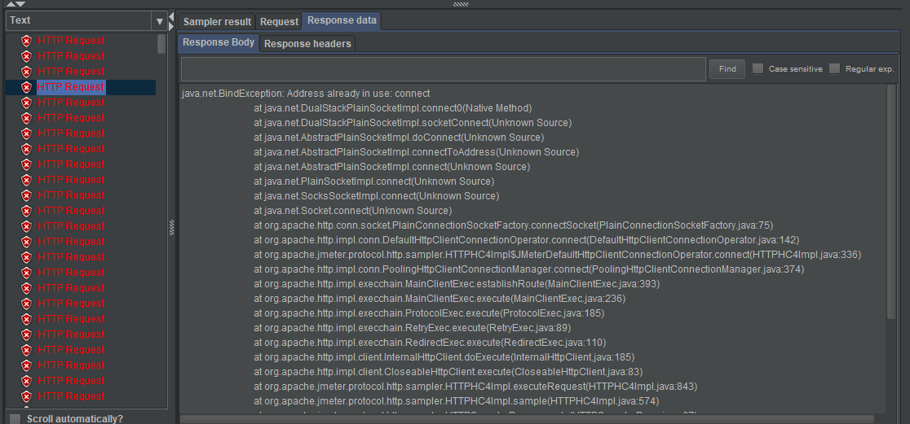

# Task2-Find the resources comsumption of REST service
## With Spring Actuator
上次作业使用了spring boot内部的一个模块spring actuator，这个可以监测service的运行情况，默认暴露出的endpoint只有/health与/info，通过配置application.properities文件，加上
```java
management.endpoints.web.exposure.include=*
```
可以暴露出全部端口

这次要用到的是/actuator/metrics
> Spring Boot Actuator provides dependency management and auto-configuration for Micrometer, an application **metrics** facade that supports numerous monitoring systems

为了方便，我就直接使用了homework2搭建好的项目，启动之后，访问`http://localhost:8080/actuator/metrics`就可以看到各项指标了

可以看到，大部分指标都是针对JVM和tomcat的，也有一些系统方面的指标

比如访问`http://localhost:8080/actuator/metrics/jvm.memory.max`可以看到java虚拟机的最大内存，访问`http://localhost:8080/actuator/metrics/jvm.memory.used`可以看到使用的内存


图中数量的单位是byte，换算一下，内存的使用情况是157.6M/3267M

当然这个数字不是固定的，短时间内多次请求这一端口，可以看到内存的使用会变大

访问`http://localhost:8080/actuator/metrics/system.cpu.usage`可以看到CPU的使用情况

当短时间多次访问时也能看出cpu的使用在上升，但多次快速点击时，cpu使用几乎不变

Spring Actuator为我们提供了很多查看service情况的端口，不过查看的方式比较麻烦，效果也不太直观

## With Spring Boot Admin
在网上查到监测服务的可视化工具，在pom.xml中加入依赖
```xml
<dependency>
	<groupId>de.codecentric</groupId>
	<artifactId>spring-boot-admin-starter-server</artifactId>
</dependency>
```
在启动springbootapp前加上注解`@EnableAdminServer`，启动服务，打开浏览器访问localhost:8080就可以看到页面了

现在由于没有其他的服务，所以看到applications为0

为了进行测试，还要新建一个其他的spring应用作为client，新建一个项目......

本来做到这里还非常顺利，然后新建好应用并配置启动之后并没有提示，然后admin端报了一个错

经过各处查询也没有找到解决办法
参考：https://stackoverflow.com/questions/53605197/calling-asyncerror-is-not-valid-for-a-request-with-async-state-must-dispatc

不仅如此，在spring initializr中生成的spring-boot-admin-client的dependency还存在一些未知的问题导致client端运行起来了之后admin端并不能接收到注册的消息

在stackoverflow上看到有人提示说把springboot内置容器改成jetty可以解决问题，改过之后启动程序，报错出现在spring-boot-admin-starter-client中，把这项依赖注释掉可以运行，但是没有client的效果


......折腾了一个下午试了各种方法没有奏效，遂放弃这一项目

## 用JMeter模拟并发访问
由于第二部分当中的可视化没有实现，所以这次的并发访问模拟也是没有很直观的展示

Postman是可以做连续访问的，但是好像没法测试并发，我在网上找到一个比较方便的工具JMeter帮助做并发测试

还是利用homework2中搭建的spring服务

### 测试hello端口
homework2中我写了一个端口/hello用于测试，只是一个简单的端口，访问该接口会放回一个hello,world字符串

一开始在JMeter中，设置好测试并发200个线程每秒，每个线程发10个请求

测试之前，先重启一下服务（感觉之前随便测的会影响一些），然后先看一下Memory使用
在空负载时，是158149544bytes，大概是150Mb
开始测试
中间访问一次，内存使用334523792bytes,大约翻了一倍，这个数据非常不精准，因为200个并发处理起来还是很容易的
第一次测试结果：

可以看出平均返回时间还是很快的

然后我设置了2000个线程每秒，结果

平均的返回时间大约多了100倍，而且会有一些报错，查看错误返回的信息，上网查得知是由于短时间新建的网络链接太多，JVM_Bind异常

而且很明显的发现，在2000/s的并发访问过程中，用postman去请求/actuator/metrics接口会有3-4秒的延迟，
中间试着去请求system.cpu.usage数值达到了1，但是jvm.memory.used差不多是500Mb，这种并发比较看重cpu的能力，由于请求的数据很简单所以内存不会溢出


## References
* https://docs.spring.io/spring-boot/docs/current/reference/html/production-ready-metrics.html
* https://www.jianshu.com/p/e9ce05b44150
* https://blog.csdn.net/qq_32447301/article/details/84978044
* http://codecentric.github.io/spring-boot-admin/2.1.4/
* https://jmeter.apache.org/usermanual/get-started.html
